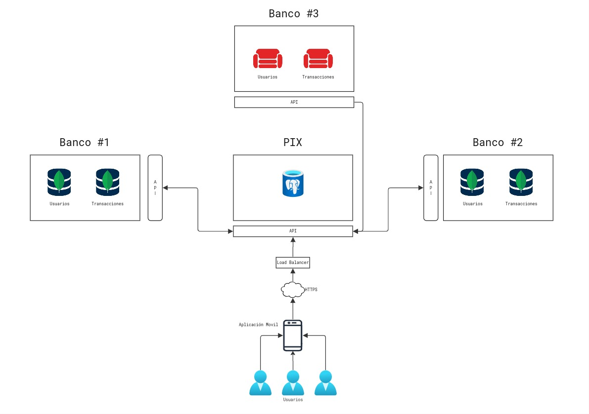
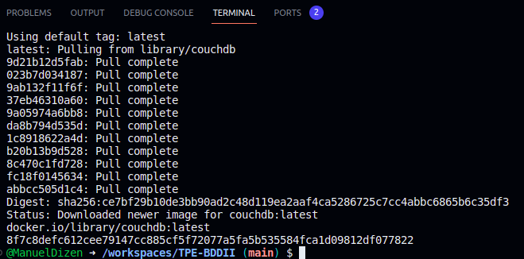
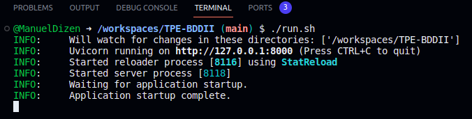
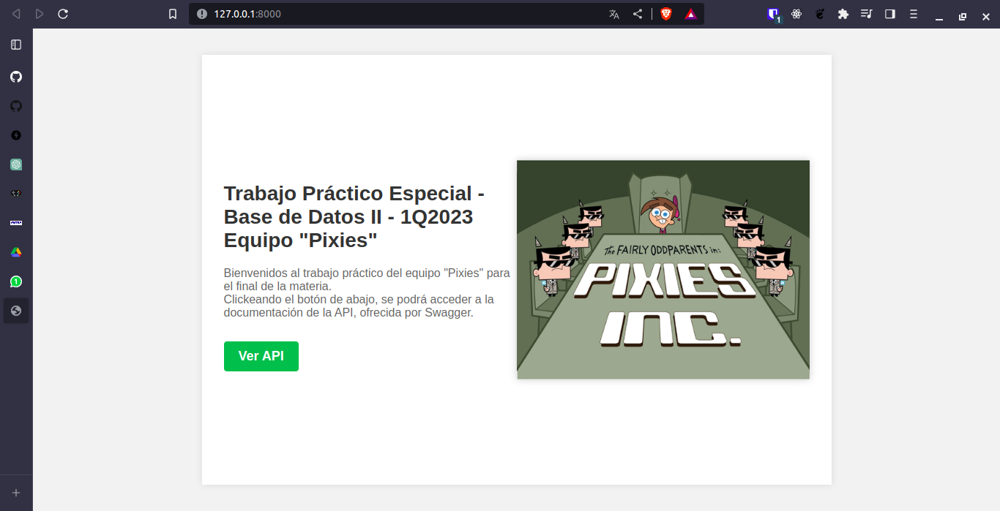
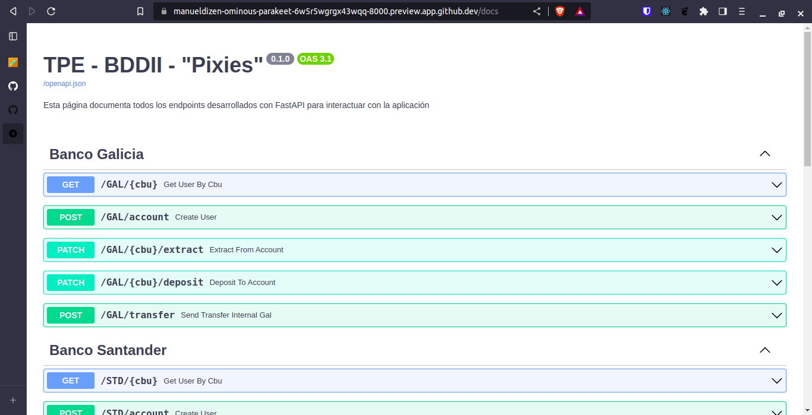
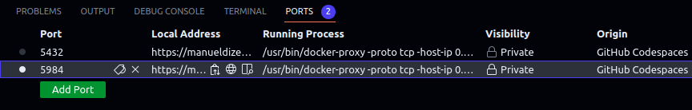
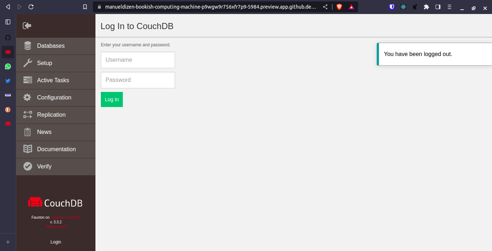
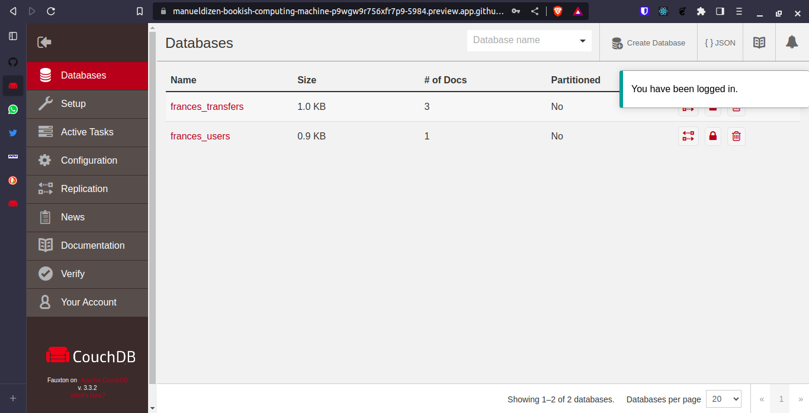

# TPE-BDDII
### Trabajo Práctico Especial para la materia "72.41 - Base de Datos II"

## Introducción y consideraciones

Este repositorio fue utilizado para el desarrollo del Trabajo Práctico Especial de la materia "72.41 - Base de Datos II". El TPE consistía en el desarrollo de la aplicación ["PIX"](https://en.wikipedia.org/wiki/Pix_(payment_system)), una aplicación de pagos digitales manejada por el Banco Central de Brasil. 

La misma tiene un paralelismo claro con la plataforma de MercadoPago, de amplia adopción en Argentina. Pagos vía QR e instantaneos, diferentes modos de pago.

[La consigna](https://voltaic-twist-d4c.notion.site/BD2-TP-Final-1Q2023-70f4f1d6776b4a7fa9d8235c7ce8c9c6) mencionaba que la implementación no debía ser _exactamente_ como lo es PIX, dado que por supuesto presentaría una complejidad gigante. Por lo que se desarrolló el _"esqueleto"_ de la misma. Esto quiere decir: La aplicación desarrollada permite registrarse en PIX únicamente con la obligación de colocar un nombre y un CUIT (de modo de constatar que la persona registrandose es efectivamente quién dice ser, y a su vez para evitar registros dobles), registrar cuentas de banco proporcionando un CBU (asociandola a la cuenta PIX correspondiente), y realizar transacciones desde la API de PIX indicando CBU fuente y CBU destino (el detalle de la implementación y las limitaciones están detallados debajo).

También se ofrece la posibilidad (aunque para hacer uso de la aplicación va a ser necesario) de utilizar APIs de bancos. Las mismas exponen la creación de usuarios, las busquedas de los mismos mediante CBU, y el depósito/extracción de dinero mediante endpoints. Una vez que se tienen estas cuentas, con un saldo determinado, se deben asociar a la cuenta de PIX desde la API de PIX, y allí se puede realizar una transacción.

## Arquitectura

La arquitectura del sistema (para el desarrollo final y futuro de la aplicación) es como se puede visualizar en la siguiente imagen:



Se modela el sistema de PIX con usuarios finales que interactuan con la API de la aplicación por medio de una aplicación movil (no desarrollada hasta el momento). Las conexiones se regulan mediante un Load Balancer (un simple nginx) con conexiones HTTPS a la API. 

Si bien nosotros exponemos las APIs de los bancos "al público", esto es en pos de hacer el sistema usable dentro del scope académico del trabajo. Si esto fuera considerado para trabajar de manera funcional, las APIs de los bancos deberían ser de uso interno unicamente.

Para trabajar con almacenamiento políglota, nosotros decidimos utilizar 3 bases diferentes: PostgreSQL, MongoDB, y CouchDB. Lo primero a notar es la diferencia entre la base relacional y las orientadas a documentos. PostgreSQL se maneja de forma relacional, y a nuestro parecer, lo que se almacena dentro de PIX tiene un formato que permite suponer un volumen de datos manejable. Mientras que para los bancos, consideramos que usar bases NoSQL orientadas a documentos tenía mayor sentido, considerando que debemos pensar en la posibilidad de la escalabilidad del sistema. A diferencia de PIX, los bancos tendrán que almacenar las n transacciones que se realicen entre cuentas. Además, una misma transacción impacta en la base de datos del banco emisor y del banco receptor, por lo que es necesario considerar todo esto.

El uso de dos bases de datos NoSQL orientadas a documentos se basó en que no todas las entidades bancarias modelan sus datos de la misma manera.

El desafio mas grande del uso de 3 bases diferentes es la interacción con las mismas, logicamente. MongoDB tiene su propio lenguaje definido, que funciona para realizar operaciones sobre sus documentos. Si bien CouchDB ofrece una libreria oficial, se optó por el uso conjunto entre ella y Requests HTTP a la base de forma directa. Estas dos formas fueron extremadamente diferentes de implementar, aunque ambas se tratan de bases orientadas a documentos.

## Configuración
El trabajo fue desarrollado con los siguientes stacks:
* Para el desarrollo de la API:
    * [Python3](https://www.python.org/)
    * [FastAPI](https://fastapi.tiangolo.com/)
    * [Uvicorn](https://www.uvicorn.org/)
* Como bases de datos:
    * [PostgreSQL](https://www.psycopg.org/) (Utilizada para el almacenamiento de las entidades de PIX)
    * [MongoDB](https://www.mongodb.com/docs/drivers/pymongo/) (Utilizada para el almacenamiento de las cuentas de banco de Galicia y Santander)
    * [CouchDB](https://github.com/pekrau/CouchDB2) (Utilizada para el almacenamiento de las cuentas de banco de BBVA Francés)

A su vez, se utilizaron diversas dependencias de el entorno de python para administrar las bases de datos mediante APIs estándar desde el código (pymongo, couchdb2, etc.).

Es importante mencionar que tanto PostgreSQL como CouchDB no ofrecen herramientas gratuitas de hosteo (no así Mongo con [Atlas](https://www.mongodb.com/atlas)), por lo que se trabajó con bases locales provistas mediante las imagenes oficiales de Docker. Es por ello que es necesario asegurarse del correcto funcionamiento del script "inicializador", dado que de eso depende que corran nuestros repositorios.

Para esto, se realizó una serie de pasos detallada para correr este proyecto sin mayores inconvenientes:

1. El trabajo fue ideado para correr en [Github Codespaces](https://github.com/features/codespaces), una herramienta gratuita provista por Github que otorga una maquina virtual UNIX expuesta a través del IDE Visual Studio Code. Por lo que se creo un script, `initialize.sh`, quién se encarga de instalar los requerimientos previos para correr el trabajo. Para correr esto, lo único que hay que hacer es:

```shell 
./initialize.sh 
```

- Nota: Es posible que el archivo no tenga permisos. Para esto, correr el comando: `chmod +x initialize.sh`

2. De no haber tenido ningún inconveniente, en la ventana `ports` de la barra inferior (visualizable cuando se abre el espacio de terminal), deberían figurar 2 puertos expuestos: `5984` (de CouchDB) y `5432` (de PostgreSQL). Si alguno NO está siendo expuesto, revisar que error surgió de la inicialización y contactar a los desarrolladores.



3. Un paso extremadamente importante: El repositorio NO CUENTA con el archivo .env con el cual se desarrollo el proyecto. Esto es lógico dado que posee todas las credenciales a las bases de datos utilizadas, mas algunas variables que no deben ser publicadas. Es por eso que se incluyo el archivo `.env.fill_in`, que tiene los valores de los campos pero vacios. Deben ser llenados para correr, **de lo contrario el sistema no correrá**. 

> Nota: Ante el enfoque académico para esta aplicación, y considerando que el hackeo de este sistema tendría un impacto nulo sobre las finanzas de los que lo vayan a testear, se provee el archivo .env de manera pública para facilitar el uso del sistema.

4. Teniendo todo correctamente seteado, simplemente corremos el script `run.sh` de la misma forma de antes (aplica la misma aclaración que para el primer script):
```shell
./run.sh
```

5. Esto debería inicializar el servidor donde se hostea nuestra API. Para acceder al mismo, hacer `CTRL + CLICK` sobre el enlace en negrita de la línea que dice `INFO: Uvicorn running on http://127.0.0.1:8000 (Press CTRL+C to quit)`. Este enlace abrirá la siguiente página:





6. Para acceder a la documentación de la API (y para poder utilizarla), lo que se debe hacer es clickear el botón que dice _"Ver API"_. Esto abrirá la documentación de la API en Swagger:



7. Desde esta interfaz, se pueden probar todos los endpoints que ofrece la API de manera gráfica. Cabe destacar que la API fue desarrollada y testeada con esta interfaz, por lo que se recomienda que su uso sea mediante la misma (aunque se puede utilizar mediante HTTP sin ningún inconveniente, es simplemente una interfaz gráfica)

Adicional: Uno podría visualizar la interfaz de ["Fauxton"](https://couchdb.apache.org/fauxton-visual-guide/#using-fauxton), ofrecido por couchdb para ver las bases de datos y documentos existentes. Para acceder desde workspace, hay que dirigirse a la _tab_ de _ports_, y hacer `CTRL + CLICK` en la columna de _Local Address_, de la entrada con el puerto **5984**, que es el que expone couch:



Esto abrira la siguiente interfaz:



Para visualizar las DBs, es necesario colocar las credenciales de acceso. Para este trabajo, y dado que ya se encuentran expuestas las credenciales de los repositorios utilizados, se coloca _Username_: **admin**, _Password_: **tpebdd2**. Debería lanzar la siguiente interfaz:



Desde allí, se puede interactuar con la base, y hasta modificar los documentos de manera directa.

Nota: Esta posibilidad no se ofrece con MongoDB dado que se encuentra en el servidor de Atlas, y para ello sería necesario exponer credenciales personales. Para PostgreSQL, se puede usar el CMDLINE, si así se lo desea. Pero al estar desarrollado en codespaces, es mas dificil conectar un IDE como DataGrip o DB Visualizer.

## Funcionamiento
Dentro de Swagger, se encontrará que la API tiene secciones. Las mismas representan las APIs de las diferentes entidades financieras. Los bancos disponibles para operar son Galicia, Santander, BBVA Francés.

Algunos endpoints requieren que se envíe un `src_bank` o un `bank_code`. Esta adaptación realizada fue para identificar internamente el esquema de bancos que tenemos. 

**Es de absoluta importancia que, a la hora de utilizar un banco fuente o destino, se utilice alguno de los siguientes códigos: GAL, STD, FRA. De no utilizarlos, el sistema no comprenderá de que banco se trata, y fallará a la hora de realizar una petición**

> Repito la aclaración: **Usar unicamente los 3 códigos indicados (GAL, STD, FRA). El resto no funcionará**

Luego, uno puede utilizar los endpoints libremente. 

## Integrantes:
Nombre | Legajo
-------|--------
[De Simone, Franco](https://github.com/desimonef) | 61100
[Dizenhaus, Manuel](https://github.com/ManuelDizen) | 61101
[De Los Ángeles Makk, Azul](https://github.com/azulamakk) | 61589
